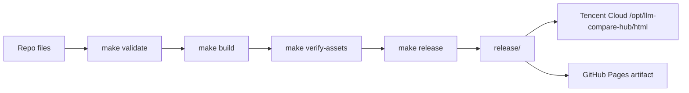

# LLM Models Hub

大模型选型与用法精粹静态站点。主生产入口是 `https://llm.lute-tlz-dddd.top/`，GitHub Pages 是镜像发布目标，不作为 canonical SEO 入口。

## 功能概览

| 页面 | 路径 | 内容 | 数据来源 |
| --- | --- | --- | --- |
| 模型列表 | `/` | PoYo.ai、硅基流动、BAI、EasyRouter 模型查询、分类筛选、curl 示例 | runtime JSON |
| 对比排序 | `/` 内 Tab | 综合 TOP、类别对比、功能场景排序；显式标注多模态、输入类型和输出类型 | `compare-data.json` |
| 免费本地模型 | `/` 内 Tab | Apple Silicon 可运行开源模型、规格和安装命令 | `free-models-data.json` |
| Claude 用法精粹 | `/claude.html` | Claude API/工程实践卡片 | `claude-data.json` |
| Codex 用法精粹 | `/codex.html` | Codex 工作流/工程实践卡片 | `codex-data.json` |

## 当前架构

```text
source repo
├── index.html                  # legacy fallback SPA 入口，canonical 指向主站
├── assets/                     # legacy bundle snapshot；正常发布优先使用 dist/assets
├── *.json                      # runtime 数据文件
├── claude.html / codex.html    # 精粹页
├── claude/ / codex/            # 短路径跳转页
├── src/                        # Vite + React 源码
├── tests/visual-baselines/      # UI smoke 桌面/移动视觉基线
├── dist/                       # build 产物，gitignored
├── scripts/
│   ├── validate.py             # JSON 数据校验
│   ├── provenance_report.py    # provenance 覆盖报告
│   ├── weekly_data_snapshot.py # 数据治理快照
│   ├── verify_assets.py        # 递归校验 dist/root 入口 asset 引用
│   ├── ui_smoke_check.mjs      # Chrome headless UI 冒烟与截图检查
│   └── build_release.py        # 生成干净 release artifact
└── release/                    # 生成产物，gitignored，仅部署该目录
```

重要约束：

- `release/` 是唯一部署物。腾讯云和 GitHub Pages 都应只发布 `release/`，不要发布仓库根目录。
- 正常发布流程会先执行 `make build`，再把 `dist/index.html` 和 `dist/assets/` 拍平到 `release/index.html` 与 `release/assets/`。
- 根 `index.html` 和根 `assets/` 仅作为 legacy fallback；不要把它们当作新的生产 UI 修改入口。
- `src/` 是当前可信 UI 修改入口；主应用、模型列表、对比排序和免费本地模型页已完成中文文案与基础视觉一致性复核。
- 生产站点不应公开 `src/`、`scripts/`、`.github/`、文档、缓存或本地工具文件。

## 发布链路



### 本地验证

```bash
make validate
make verify-assets
make typecheck
make build
make release
make data-update-check
make smoke-ui
```

### 腾讯云部署

```bash
make deploy-dry
make deploy
make check
make check-exposure
make smoke-ui-production
```

默认优先使用 `/Users/lute/project/Agent/product/llm_models_hub/ai_video.pem`（若不存在则回退到 `~/.ssh/llm-compare-hub.pem`），不会读取工作区内的私钥。`make deploy` 会先生成 `release/`，再用 `rsync --delete release/` 同步到腾讯云静态目录。

### GitHub Pages

`.github/workflows/deploy.yml` 在 push 到 `main` 后执行：

1. `npm ci --prefix src`
2. `make data-update-check`
3. 探测 Chrome/Chromium 并设置 `CHROME_PATH`
4. `make smoke-ui`
5. 上传 `release/`

GitHub Pages 是镜像发布目标。页面 canonical、robots 和 sitemap 均指向 `https://llm.lute-tlz-dddd.top/` 主站，避免重复索引。

## 数据文件

| 文件 | 内容 | 当前规模 |
| --- | --- | --- |
| `api-data.json` | PoYo.ai 模型/API 文档 | 71 models |
| `siliconflow-data.json` | 硅基流动模型/API 文档 | 65 models |
| `bai-data.json` | BAI 模型/API 文档 | 9 models |
| `easyrouter-data.json` | EasyRouter 模型/API 文档 | 14 models |
| `compare-data.json` | 跨平台排序、类别和功能场景推荐；包含 `modalities` 输入/输出类型标注 | TOP/分类/功能榜 |
| `free-models-data.json` | 本地免费模型推荐 | 10 models |
| `claude-data.json` | Claude 用法精粹 | 卡片数据 |
| `codex-data.json` | Codex 用法精粹 | 卡片数据 |

数据修改流程：

```bash
make data-update-check
make deploy-dry
make deploy
make check
make check-exposure
```

所有 JSON 都是 runtime fetch；数据文件更新不会改变 React bundle 逻辑，但标准流程仍会重新执行 `make build`，确保 `release/` 总是来自最新可复现构建产物。

## SEO 策略

- 主 canonical：`https://llm.lute-tlz-dddd.top/`
- `robots.txt` 指向主站 sitemap：`https://llm.lute-tlz-dddd.top/sitemap.xml`
- `sitemap.xml` 只收录主站 URL：
  - `/`
  - `/claude.html`
  - `/codex.html`
- `/claude/` 和 `/codex/` 是跳转页，不进入 sitemap。

## 生产环境

| 项目 | 当前值 |
| --- | --- |
| 静态文件目录 | `/opt/llm-compare-hub/html/` |
| 发布源 | 本地/CI 生成的 `release/` |
| 反向代理 | 共享 nginx 容器 `ai_video_nginx` |
| 主站域名 | `https://llm.lute-tlz-dddd.top/` |
| 镜像域名 | `https://zjgulai.github.io/llm-compare-hub/` |

nginx 对 `src/`、`scripts/`、`.github/`、`.essence-cache/`、文档和隐藏文件有额外 404 拦截；`/assets/` 缺失 hash 资源直接返回 404，不会落到 SPA fallback；但正确做法仍是只发布 `release/`。

## 工具目标

| 命令 | 作用 |
| --- | --- |
| `make validate` | 校验 JSON 结构、schema 字段完整度、模型数量、modelId 唯一性/交叉引用、对比页 modalities 和弃用模型残留 |
| `make validate-provenance` | 严格校验平台模型 provenance 覆盖 |
| `make provenance-report` | 输出平台模型 provenance 覆盖报告 |
| `make verify-assets` | 递归检查 `index.html` 和 JS chunks 引用的 assets 是否存在 |
| `make typecheck` | 对 `src/` 执行 TypeScript 检查 |
| `make build` | 将 `src/` 构建到 `dist/`，不影响生产根入口 |
| `make release` | 先验证数据并构建 `dist/`，再生成干净发布目录 `release/` |
| `make smoke-ui` | 本地启动 `release/` 预览并用 Chrome headless 检查核心 UI、键盘导航、tab/tabpanel 语义、颜色对比度、移动端触控目标、缺失 asset 404 和视觉 diff |
| `make smoke-ui-update-baselines` | 确认 UI 变化符合预期后，刷新 `tests/visual-baselines/` 的桌面/移动视觉基线 |
| `make smoke-ui-production` | 对腾讯云生产站执行同一组 UI smoke、a11y 门禁与视觉 diff 检查 |
| `make deploy-dry` | 预演腾讯云发布与远端删除 |
| `make deploy` | 发布 `release/` 到腾讯云并清理远端残留 |
| `make check` | 检查主站和核心 JSON HTTP 状态 |
| `make check-exposure` | 检查开发材料是否仍不可公网访问 |
| `make data-update-check` | 数据更新本地验收：validate、provenance、周报、build、release |
| `make data-update-dry` | 数据更新发布演练：`data-update-check` + `deploy-dry` |
| `make data-update-deploy` | 数据更新正式发布：`data-update-check` + `deploy` + 生产验收 |

可选联网校验：

```bash
python3 scripts/validate.py --check-urls
```

该命令会抽查唯一 `docsUrl` 的 HTTP 状态，适合数据更新批次发布前使用。

### 数据 provenance 与漂移监控

- `sourceUrl`: 字段来源或验证入口。
- `verifiedAt`: 最近人工或脚本验证日期，格式 `YYYY-MM-DD`。
- `confidence`: `high`、`medium`、`low`。
- `sourceType`: `official-docs`、`official-release-notes`、`official-api-list`、`vendor-site`、`curated-manual`。

常用命令：

```bash
python3 scripts/provenance_report.py
python3 scripts/provenance_report.py --stale-days 60
python3 scripts/check_data_drift.py
python3 scripts/check_data_drift.py --update-snapshot
make validate-provenance
```

## 周报与周度治理快照

```bash
# 生成周度快照（JSON + Markdown）
make weekly-snapshot

# 指定文件日期与过期阈值
python3 scripts/weekly_data_snapshot.py --date 2026-06-12 --stale-days 45 --output-dir artifacts/weekly
```

`weekly_data_snapshot.py` 会：

- 统计各类 JSON 的文件哈希和模型规模（含分类分布、弃用模型数量）；
- 统计平台模型的 provenance 覆盖率和 `verifiedAt` 超过阈值的样本；
- 汇总 compare 页的 multimodal / 输入输出类型覆盖；
- 汇总 `data-provenance-snapshots.json` 漂移结果（含失败 URL）；
- 与上一次周报文件做差异（文件 hash / 模型数 / 分类数）；
- 输出：
  - `artifacts/weekly/data-snapshot-<YYYY-MM-DD>.json`
  - `artifacts/weekly/data-snapshot-<YYYY-MM-DD>.md`
- 数据更新批次建议优先使用 `make data-update-check`，再视情况执行 `make data-update-dry` 或 `make data-update-deploy`。
- 如需手工复盘，可直接套用
  [周度数据治理模板](docs/templates/weekly-data-governance-template.md)。
- 回滚流程见 [ROLLBACK.md](docs/ROLLBACK.md)。

`make validate-provenance` 已接入发布链路（`Deploy to GitHub Pages`）作为严格 provenance 门禁。`check_data_drift.py` 会报告来源页 hash 变化；这类 `DRIFT` 输出用于人工复核，不会自动修改数据。

## 剩余高优先级事项

1. 轮换曾经出现在 git remote URL 中的 GitHub token。
2. 轮换生产 nginx 配置里硬编码的第三方 API key，并迁移到安全注入方式。
3. 将当前 a11y 门禁继续扩展到 Claude/Codex 精粹页、更多移动断点和更细的焦点可视化规则。
4. `make validate-provenance` 已接入发布链路；继续保持 provenance 字段的 `high/medium` 与 `verifiedAt` 的时效复核。

更多审计记录见 [AUDIT.md](AUDIT.md)，变更记录见 [CHANGELOG.md](CHANGELOG.md)。
