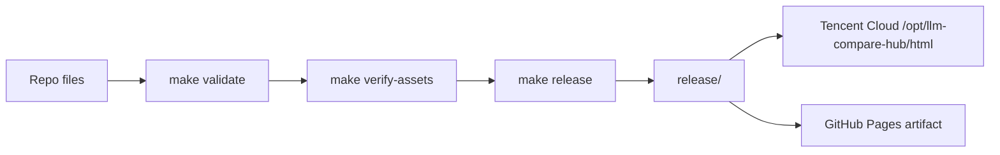

# LLM Models Hub

大模型选型与用法精粹静态站点。主生产入口是 `https://llm.lute-tlz-dddd.top/`，GitHub Pages 是镜像发布目标，不作为 canonical SEO 入口。

## 功能概览

| 页面 | 路径 | 内容 | 数据来源 |
| --- | --- | --- | --- |
| 模型列表 | `/` | PoYo.ai、硅基流动、BAI、EasyRouter 模型查询、分类筛选、curl 示例 | runtime JSON |
| 对比排序 | `/` 内 Tab | 综合 TOP、类别对比、功能场景排序；显式标注多模态、输入类型和输出类型 | `compare-data.json` |
| 免费本地模型 | `/` 内 Tab | Apple Silicon 可运行开源模型、规格和安装命令 | `free-models-data.json` |
| Claude 用法精粹 | `/claude.html` | Claude API/工程实践卡片 | `claude-data.json` |
| Codex 用法精粹 | `/codex.html` | Codex 工作流/工程实践卡片 | `codex-data.json` |

## 当前架构

```text
source repo
├── index.html                  # 当前生产 SPA 入口，canonical 指向主站
├── assets/                     # 当前生产 bundle snapshot
├── *.json                      # runtime 数据文件
├── claude.html / codex.html    # 精粹页
├── claude/ / codex/            # 短路径跳转页
├── src/                        # 可 typecheck/build 的 React 重建源码
├── scripts/
│   ├── validate.py             # JSON 数据校验
│   ├── verify_assets.py        # 递归校验生产 asset 引用
│   └── build_release.py        # 生成干净 release artifact
└── release/                    # 生成产物，gitignored，仅部署该目录
```

重要约束：

- `release/` 是唯一部署物。腾讯云和 GitHub Pages 都应只发布 `release/`，不要发布仓库根目录。
- 根 `index.html` 当前引用的是生产中文 UI bundle snapshot：`assets/index-DltUXhyr.js` 和 `assets/index-CdBRW1VH.css`。
- `src/` 目前能通过 typecheck/build，但它是英文重建版，不是当前生产中文 UI 的完整可信源码。修改生产 UI 前，应先让 `src/` 与生产 UI 对齐，或明确替换生产 bundle 的产品决策。
- 生产站点不应公开 `src/`、`scripts/`、`.github/`、文档、缓存或本地工具文件。

## 发布链路



### 本地验证

```bash
make validate
make verify-assets
make typecheck
make build
make release
```

### 腾讯云部署

```bash
make deploy-dry
make deploy
make check
make check-exposure
```

部署使用 `~/.ssh/llm-compare-hub.pem`，不会读取工作区内的私钥。`make deploy` 会先生成 `release/`，再用 `rsync --delete release/` 同步到腾讯云静态目录。

### GitHub Pages

`.github/workflows/deploy.yml` 在 push 到 `main` 后执行：

1. `npm ci --prefix src`
2. `make validate`
3. `make verify-assets`
4. `make build`
5. `make release`
6. 上传 `release/`

GitHub Pages 是镜像发布目标。页面 canonical、robots 和 sitemap 均指向 `https://llm.lute-tlz-dddd.top/` 主站，避免重复索引。

## 数据文件

| 文件 | 内容 | 当前规模 |
| --- | --- | --- |
| `api-data.json` | PoYo.ai 模型/API 文档 | 71 models |
| `siliconflow-data.json` | 硅基流动模型/API 文档 | 65 models |
| `bai-data.json` | BAI 模型/API 文档 | 9 models |
| `easyrouter-data.json` | EasyRouter 模型/API 文档 | 14 models |
| `compare-data.json` | 跨平台排序、类别和功能场景推荐；包含 `modalities` 输入/输出类型标注 | TOP/分类/功能榜 |
| `free-models-data.json` | 本地免费模型推荐 | 10 models |
| `claude-data.json` | Claude 用法精粹 | 卡片数据 |
| `codex-data.json` | Codex 用法精粹 | 卡片数据 |

数据修改流程：

```bash
make validate
make release
make deploy-dry
make deploy
```

所有 JSON 都是 runtime fetch；数据文件更新不需要重建 React bundle，但仍必须重新生成 `release/` 并部署。

## SEO 策略

- 主 canonical：`https://llm.lute-tlz-dddd.top/`
- `robots.txt` 指向主站 sitemap：`https://llm.lute-tlz-dddd.top/sitemap.xml`
- `sitemap.xml` 只收录主站 URL：
  - `/`
  - `/claude.html`
  - `/codex.html`
- `/claude/` 和 `/codex/` 是跳转页，不进入 sitemap。

## 生产环境

| 项目 | 当前值 |
| --- | --- |
| 静态文件目录 | `/opt/llm-compare-hub/html/` |
| 发布源 | 本地/CI 生成的 `release/` |
| 反向代理 | 共享 nginx 容器 `ai_video_nginx` |
| 主站域名 | `https://llm.lute-tlz-dddd.top/` |
| 镜像域名 | `https://zjgulai.github.io/llm-compare-hub/` |

nginx 对 `src/`、`scripts/`、`.github/`、`.essence-cache/`、文档和隐藏文件有额外 404 拦截；但正确做法仍是只发布 `release/`。

## 工具目标

| 命令 | 作用 |
| --- | --- |
| `make validate` | 校验 JSON 结构、schema 字段完整度、模型数量、modelId 唯一性/交叉引用、对比页 modalities 和弃用模型残留 |
| `make verify-assets` | 递归检查 `index.html` 和 JS chunks 引用的 assets 是否存在 |
| `make typecheck` | 对 `src/` 执行 TypeScript 检查 |
| `make build` | 将 `src/` 构建到 `dist/`，不影响生产根入口 |
| `make release` | 生成干净发布目录 `release/` |
| `make deploy-dry` | 预演腾讯云发布与远端删除 |
| `make deploy` | 发布 `release/` 到腾讯云并清理远端残留 |
| `make check` | 检查主站和核心 JSON HTTP 状态 |
| `make check-exposure` | 检查开发材料是否仍不可公网访问 |

可选联网校验：

```bash
python3 scripts/validate.py --check-urls
```

该命令会抽查唯一 `docsUrl` 的 HTTP 状态，适合数据更新批次发布前使用。

### 数据 provenance 与漂移监控

- `sourceUrl`: 字段来源或验证入口。
- `verifiedAt`: 最近人工或脚本验证日期，格式 `YYYY-MM-DD`。
- `confidence`: `high`、`medium`、`low`。
- `sourceType`: `official-docs`、`official-release-notes`、`official-api-list`、`vendor-site`、`curated-manual`。

常用命令：

```bash
python3 scripts/provenance_report.py
python3 scripts/check_data_drift.py
python3 scripts/check_data_drift.py --update-snapshot
make validate-provenance
```

`make validate-provenance` 是严格门禁预演：当前不会接入发布链路，直到所有 provider 都补齐 provenance。`check_data_drift.py` 会报告来源页 hash 变化；这类 `DRIFT` 输出用于人工复核，不会自动修改数据。

## 剩余高优先级事项

1. 轮换曾经出现在 git remote URL 中的 GitHub token。
2. 轮换生产 nginx 配置里硬编码的第三方 API key，并迁移到安全注入方式。
3. 决定 `src/` 的下一步：要么复刻当前中文生产 UI，要么正式以 `src/` 重建版替换生产 UI。
4. 继续补齐 SiliconFlow 剩余模型 provenance，并将严格 provenance 门禁接入 CI。

更多审计记录见 [AUDIT.md](AUDIT.md)，变更记录见 [CHANGELOG.md](CHANGELOG.md)。
